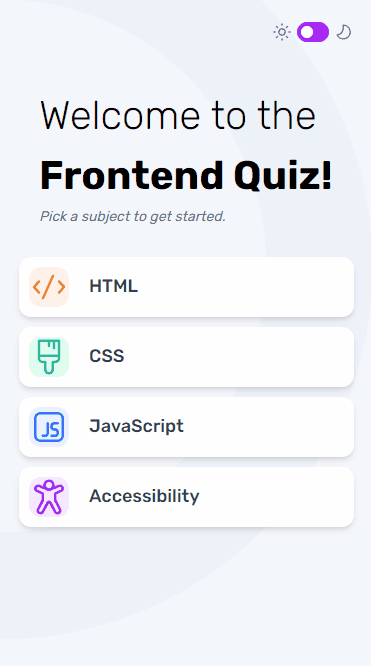

# Frontend Mentor - Frontend quiz app solution

## Overview

This is a solution to the [Frontend quiz app challenge on Frontend Mentor](https://www.frontendmentor.io/challenges/frontend-quiz-app-BE7xkzXQnU). Frontend Mentor challenges help you improve your coding skills by building realistic projects.

### Links

- Solution URL: [Frontend mentor solution](https://www.frontendmentor.io/solutions/responsive-quizz-nextjs-tailwindcss-typescript-oQVQoO9Sh7)
- Live Site URL: [FrontendQuizz](https://cfaquizzpoc.netlify.app/)

## My process

My designing process were inpired from the [Thinking in React](https://react.dev/learn/thinking-in-react) documentation. First, I beak down the IU into a component
following the single [responsibility principle](https://en.wikipedia.org/wiki/Single_responsibility_principle).

### Built with

- Mobile-first workflow
- [TypeScript](https://www.typescriptlang.org/)
- [React](https://reactjs.org/) - JS library
- [Next.js](https://nextjs.org/) - React framework
- [Tailwindcss](https://tailwindcss.com/) - For styles

### Continued development

The first version of the application use mock data. I'd like to build a fullstack application using firebase to have personalize quizz based on my notes of Charterd Financial Analyst (CFA) learning. To enhance my knowledge
of cloud architechture I would like to use firestore as backend.

### Useful resources

- [Tailwindcss cheat sheet](https://nerdcave.com/tailwind-cheat-sheet) - This helped me find tune tailwindcss configuration.
- [React documentation](https://react.dev/learn/thinking-in-react) - This is the documentaiton of react.
- [Typescript course](https://www.codecademy.com/learn/learn-typescript) - A senior dev recommand me this site to learn typescrit in depth. I prefer to learn new concept form official documentations, but this site seems cool so I'll give it a try.

## Author

- Frontend Mentor - [@c00rni](https://www.frontendmentor.io/profile/c00rni)
